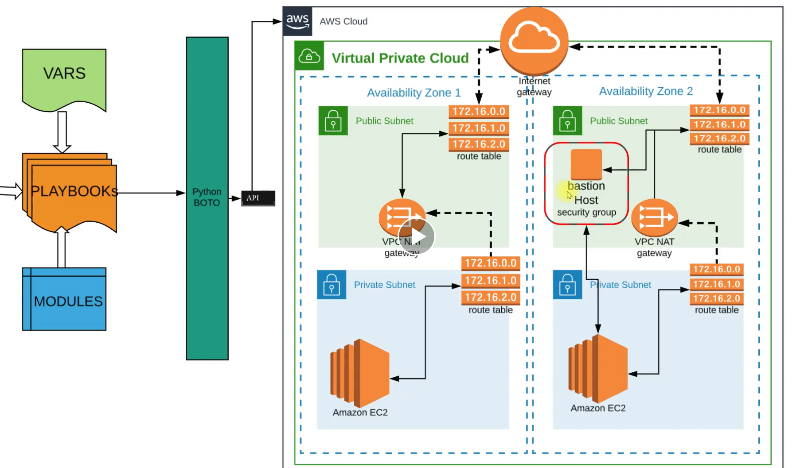

## infrastructure provisioning using Ansible as IAC. 

- This project entails provisioning of an AWS infrastructure consisting of a VPC. Withing the VPC we has 2 public subnets and 2 private subnets. Each private subnet has an EC2 instance.

- Both Public VPC has a VPC Nat gateway for internet connection, with each subnet having its own route table. 

- There is a Bastion host in one of the Public subnet with its own security group.

## Project Prequisites 

- Install Ansible
- Install boto3 on your VM on Cloud EC2 instance 

## Infrastructure Architecture



## To provision the infrastructure use below ansible playbook command 

```bash
ansible-playbook nameOfplaybook.yml
ansible-playbook vpc-setup.yml
ansible-playbook bastion-instance.yml
```